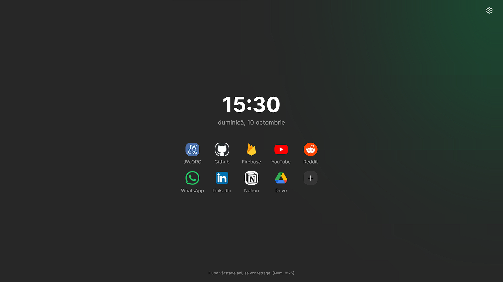

# Custom new tab page for any browser

A custom homepage for the browser startup, featuring a minimalist design with a clock, the date and a few bookmarks. The page connects with your Google account and saves your bookmarks and preferences. The page was built on top on NextJS and Firebase.

## Getting started

Check the instructions for [Edge](#edge), [Chrome](#chrome), [Opera](#opera) or [Firefox](#firefox)

### Edge

1. Go to _Settings_
2. Go to _Start, home and new tabs_
3. On the _When Edge starts_ section choose **Open these pages**
4. Clear the existent pages, if there are any, and click on **Add new page**
5. Enter https://new-tab.andreimuntean.dev/

### Chrome

1. Go to _Settings_
2. Go to _On startup_
3. Choose **Open a specific page or set of pages**
4. Clear the existent pages, if there are any, and click on **Add new page**
5. Enter https://new-tab.andreimuntean.dev/

### Opera

1. Go to _Settings_
2. Go to _Set pages_
3. Clear the existent pages, if there are any, and click on **Add new page**
4. Enter https://new-tab.andreimuntean.dev/

### Firefox

1. In the _Preferences_ menu go to _Settings_
2. Click the _Home_ panel
3. Go to _Homepage and new windows_
4. Choose _Custom URLs_
5. Enter https://new-tab.andreimuntean.dev/
